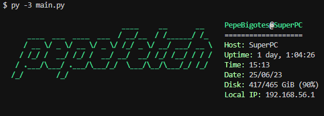

<div align="center">


### 📜 A system information tool writen in python, heavily inspired by [neofetch](https://github.com/dylanaraps/neofetch)  

</div>

## 🔧 Installation

First of all, clone the repository:  

```bash
git clone https://github.com/PepeBigotes/pepefetch
```

Now make sure the required libraries are installed:  

```bash
cd pepefetch && pip3 install -r requirements.txt
```

And you are done! You can now execute `main.py` to use pepefetch:  

```bash
py -3 main.py
```

or if you have an older system...

```bash
python3 main.py
```

## 🖌 Customization

You can easily customize and configure this tool through the next files in the `/custom` directory:

- `config.py`: Configuration file to set parameters like colors, symbols, custom variables, formats, etc.  
- `infos.py`: Script that calls all the info() functions so you can easily reorder or enable/disable these 'infos' as you like. You can also put your own prints here.  
